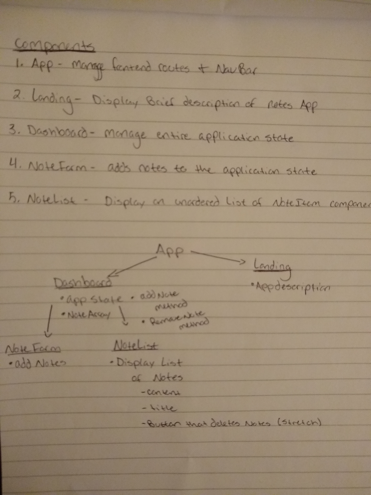

# React Routes
Add notes to a list of notes with id, content, and title.
Navigate to the Dashboard to create, update, and delete notes! Use the command ```npm run watch```
from your terminal to start the application
 ## Prereqs
 IDE, Node, React, NPM
 ## Install
 git clone to the desired directory using the link found in this repo. Use the ```npm i``` command to install all necessary packages to run the application.
 ## Map
 
 ## Author
 Tom North